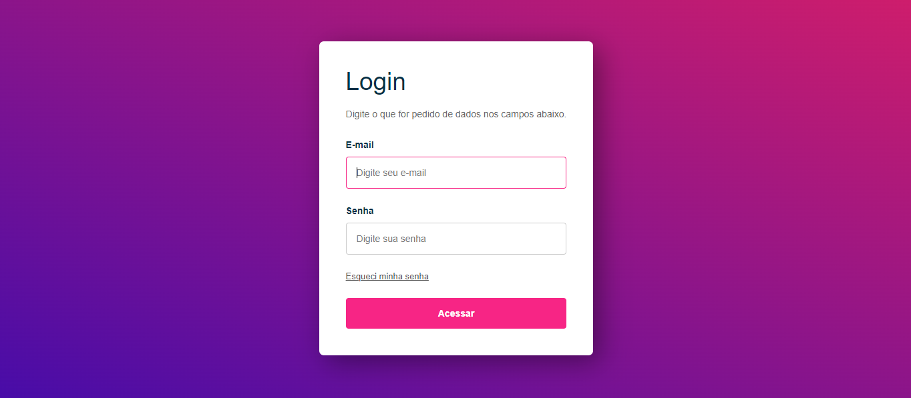
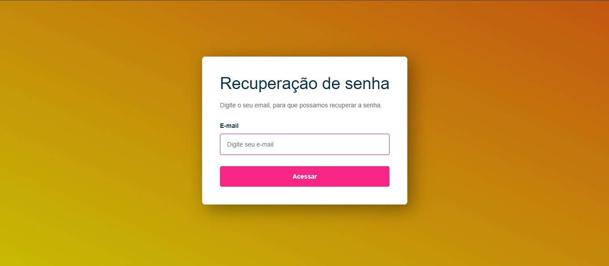
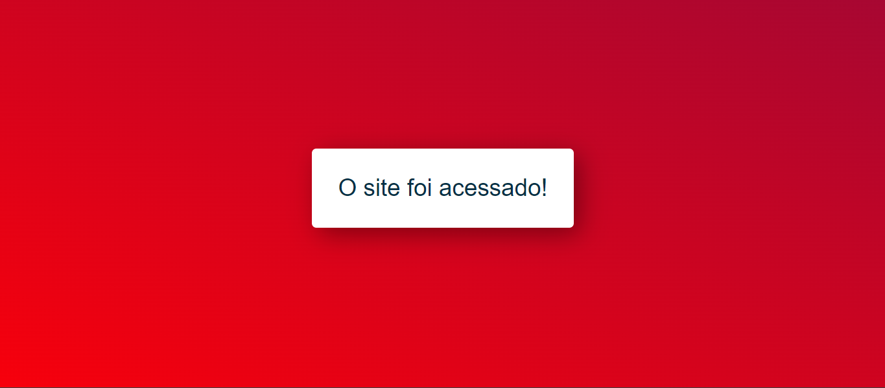
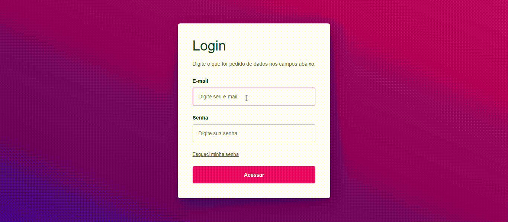

# Tela-de-login
Essa é uma tela de login experimental e funcional. Nesse site é possivel você acessar o site normalmente, sendo obrigatorio preencher os campos de acesso. No site também existem uma função caso você tenha esquecido sua senha, você pode ir a outro site clicando em "esqueci minha senha" para recupera-la.

## Descrição 
O site ele existe 3 vaaições, uma sendo a pagina de login principal, onde dela voce pode ir para uma pagina secundaria, caso esquecesse a senha, ou efetuar o login normalmente, aonde voce vai a outro site. Quando se clica em "esqueci minha senha" você é redirecionado a outro site, aonde é possivel colocar seu login, esse site não leva a lugar nenhum. E caso você efetue o login normalmente você é redirecionado a um outro site, aonde apenas tem uma mensagem dizendo que o login foi efetuado

## Função
O site apenas tem a função de fazer uma simulação de uma tela de login, contendo Javascript, html, paginas diversas, e css, e com a função de ser direcionado a outros sites.

## Tecnologias utilizadas 

* ``HTML 5``
* ``CSS 3``
* ``Java Script``
* ``Github``
* ``VsCode``
* ``Microsoft Teams``

## Autor
Kleyverson de Oliveira Sampaio